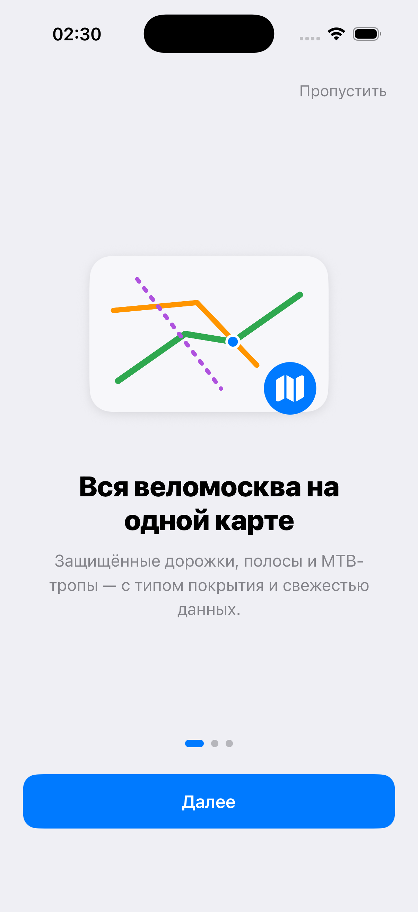
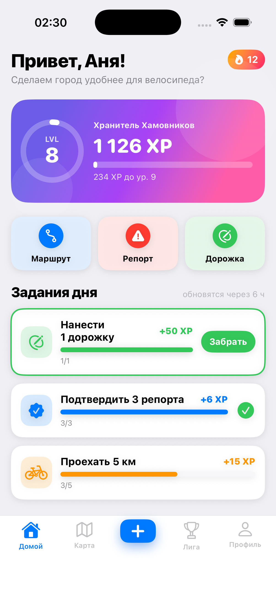
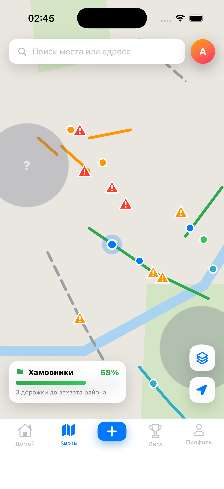
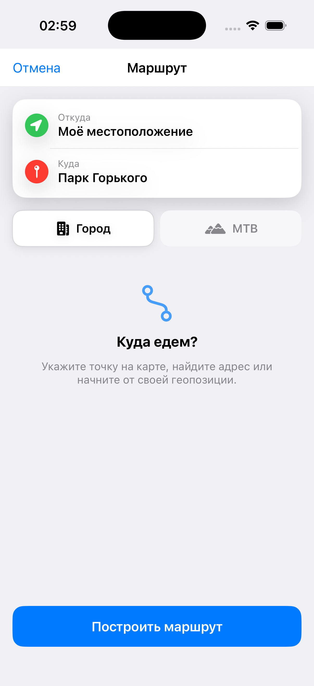
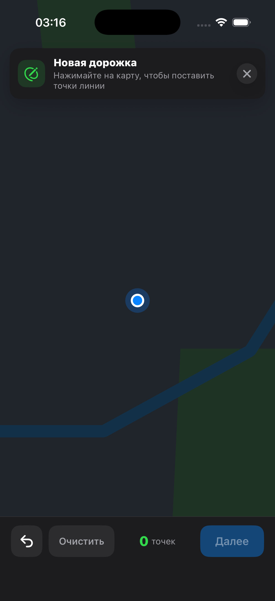
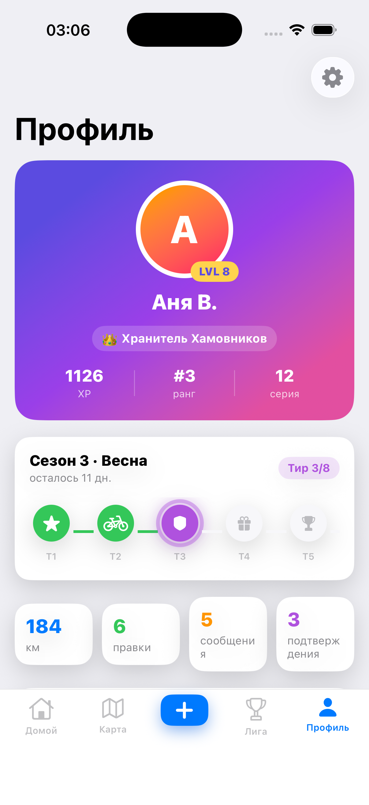
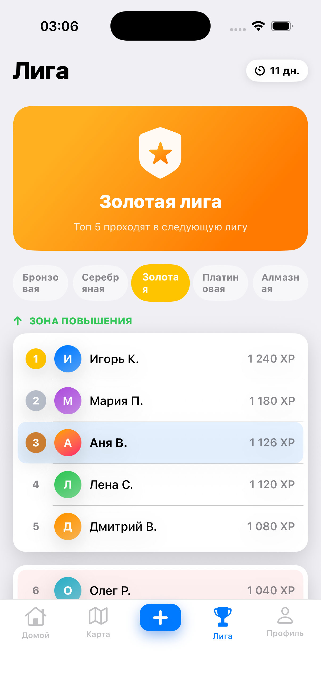

# Velocity — «Велоквест»

Gamified cycling-map app for Moscow (VeloQuest design direction). iOS SwiftUI app +
Fastify/PostGIS backend. **Runs locally — the backend isn't hosted yet.**

- Product spec: [spec.ru.md](spec.ru.md) · [spec.en.md](spec.en.md)
- Design handoff (source of truth for visuals): `design-handoff/design_handoff_veloquest/`
- Logo generation prompt: [logo-prompt.md](logo-prompt.md)

## Screenshots

| Onboarding | Home / Quest Hub | Map | Route |
| --- | --- | --- | --- |
|  |  |  |  |

| Draw a lane | Level-up | Profile | League |
| --- | --- | --- | --- |
|  |  |  |  |

## Run it locally

### 1. Backend (Docker + Node)
```bash
cd backend
npm install
npm run db:up      # Postgres + PostGIS in Docker (host port 5544)
npm run dev        # migrates + seeds + serves on http://localhost:8787
```
See [backend/README.md](backend/README.md) for the full API. Local dev uses a
`/auth/dev` sign-in stand-in and auto-moderates community edits so the reward loop
is demoable; external routing/geocoding fall back to offline implementations.

### 2. iOS app (Xcode 26, iOS 17+)
```bash
cd ios
xcodegen generate                     # regenerate Velocity.xcodeproj
open Velocity.xcodeproj                # ⌘R on an iPhone 17 simulator
```
Or build + run headless:
```bash
xcodebuild -project Velocity.xcodeproj -scheme Velocity \
  -sdk iphonesimulator -destination 'platform=iOS Simulator,name=iPhone 17' \
  -derivedDataPath build build
xcrun simctl install booted build/Build/Products/Debug-iphonesimulator/Velocity.app
xcrun simctl launch booted com.velocity.app
```
The simulator reaches the backend at `localhost:8787`. Base map tiles are external
(OpenFreeMap per the spec) but blocked in some sandboxes, so the map uses a
self-contained **offline style** (themed background + local park/river geometry)
with our GeoJSON infrastructure/POI/report layers drawn on top.

### QA launch arguments (test-only, inert without them)
`-autologin` (skip onboarding + dev sign-in) · `-auth` (show sign-in) ·
`-tab N` (0 Home/1 Map/3 League/4 Profile) · `-lang ru|en` · `-theme system|light|dark` ·
`-flow report|draw|poi|route` · `-push settings|rides|about|rules|favorites|reports|edits` ·
`-card segment|poi|report` · `-levelup` · `-reward`.

## What's implemented

Onboarding · mandatory sign-in (Apple/Google → backend JWT) · Home/Quest Hub
(level ring, streak, daily quests + claim, badges, district leaderboard) · Map
(MapLibre, infra by type + MTB + POI + reports + me + fog-of-war + district
conquest + search + layer toggles + bottom-sheet cards) · A→B routing (City/MTB,
stats, infra %, elevation chart) · problem reports (categories, photos) ·
draw-a-lane (tap points, type/surface) → level-up celebration · add POI · Profile
game-passport (season/battle-pass, stats, streak, badges + detail) · Duolingo-style
League (promotion/demotion) · Rides (HealthKit read, device-local) ·
Settings/About/Rules/Privacy (RU/EN toggle, light/dark, account deletion, OSM/ODbL
attribution). Full RU/EN localization, instant language toggle, light + dark themes.

## Stack
- **iOS:** Swift 5, SwiftUI, MVVM, `@Observable`, MapLibre Native (SPM), HealthKit, XcodeGen.
- **Backend:** TypeScript, Fastify, PostgreSQL 16 + PostGIS, JWT, local disk uploads.

## License

[MIT](LICENSE) © 2026 dever.io

Map data © OpenStreetMap contributors, [ODbL](https://opendatacommons.org/licenses/odbl/). Base tiles by [OpenFreeMap](https://openfreemap.org/).
