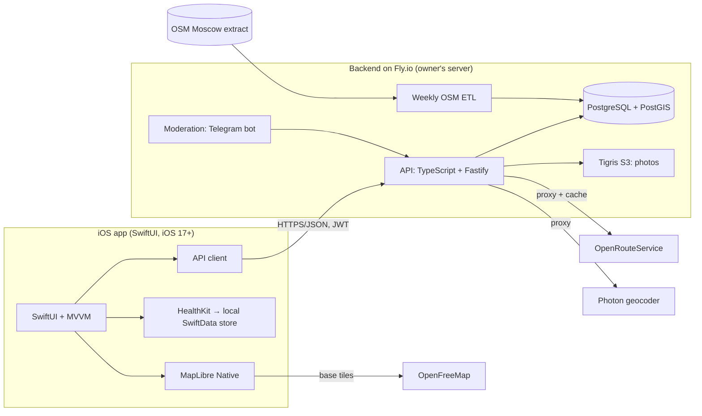

# Velocity — MVP Specification

**Version:** 0.1 · **Date:** 2026-07-08 · **Status:** draft for approval
**Working title:** "Velocity" (placeholder — final name pending, see §15)
**MVP platform:** iOS (Swift/SwiftUI) · **Pilot city:** Moscow
**Русская версия:** [spec.ru.md](spec.ru.md)

---

## 1. Vision

A map app for urban cyclists: all of the city's cycling infrastructure and useful places on one map, bike routing from A to B — with data that is always fresh, because the cycling community itself keeps it updated and gets rewarded for doing so.

**Problem:** it is unclear how to ride across the city safely and comfortably. Regular navigation apps route you like a car; bike-lane data is scattered and goes stale quickly.

**Solution:** a cycling-infrastructure map (including lane types and MTB trails) + bike-related POI + A→B bike routing + crowdsourced edits and reports with a reward system.

**Key differentiator** (owner's decision): convenience and accuracy; the data stays fresher than anyone else's thanks to users whose contributions are rewarded.

## 2. Audience and personas

**Primary audience:** Moscow urban riders — commuting to work, school, and errands.

**Personas:**

1. **Anya, 28, bike commuter.** Wants routes with maximum protected lanes and minimum dangerous crossings. Values: A→B routing that prefers infrastructure, closure warnings.
2. **Sergey, 35, weekend rider.** Rides in parks and along embankments, sometimes with his kid. Values: a lane map with types (where it's safe with a child), drinking fountains, parking, repair shops nearby.
3. **Dima, 30, MTB enthusiast (secondary).** Rides in Bitsa and Krylatskoye. Values: a trail layer with difficulty and surface, routing to trailheads, condition reports.

## 3. Competitors and positioning

| Competitor | What it does | Why we are different |
|---|---|---|
| Komoot / Strava | sport and touring, ride planning | we are about the everyday city: infrastructure, safety, freshness |
| Google/Apple/Yandex Maps | cycling is a secondary mode; the lane layer is thin and stale | cycling infrastructure is our first-class citizen, updated by the community |
| Bikemap | global route map | hyper-local accuracy in the pilot city + rewards for edits |
| OsmAnd / OSM apps | the power of OSM, but a UI for geeks | we make the same data core friendly for a regular city dweller |

Positioning: **the most accurate and freshest city-cycling map, maintained by the community itself.**

## 4. MVP scope

### In scope

- Moscow map (MapLibre, custom style, light/dark theme).
- Cycling-infrastructure layer with types and surface + MTB-trail layer with difficulty.
- POI (minimal set): repair shops, bike parking, rentals/bike-share, drinking fountains.
- A→B routing, "City" and "MTB" profiles, elevation profile.
- Problem reports with photos (pothole, glass, construction/closure, hazard, other) + confirm/expire flow.
- User-submitted infrastructure edits (new lane, correction) with moderation — the core of the product.
- Points for accepted contributions, "My contribution" screen.
- Mandatory sign-in: Sign in with Apple + Google.
- Profile: favorite places and routes, my reports and edits, points, account deletion.
- Ride import from Apple Health (track, distance, speed, heart rate) — stored locally on device.
- RU/EN localization, dark theme, iOS 17+.

### Out of scope (non-goals for MVP)

- Android app (phase 2; the API is platform-neutral from day one).
- Turn-by-turn voice navigation.
- In-app ride recording (rides come from Apple Health).
- Offline mode (architecture must not block adding it later).
- GPX import/export.
- Push notifications (phase 2 — they require the paid Apple Developer account).
- Monetization, ads, paid features.
- Social features: comments, follows, feed, leaderboards (leaderboard — phase 2).
- Web version, iPad optimization, Apple Watch.
- Writing edits directly to OSM (our edits live in our own DB; OSM contribution — phase 2, see §12).

## 5. Key user scenarios

1. **First launch:** onboarding (2–3 value screens) → sign in with Apple/Google → city map with layers enabled.
2. **See where it's safe to ride:** open the map → lane-type legend → tap a segment → type, surface, source, freshness.
3. **Get from A to B:** set points (tap/search/"me") → "City" profile → route with distance, time, elevation gain and elevation chart → save to favorites.
4. **Report a problem:** "+" button → category → point (defaults to current location) → photo → submit → the report is visible to everyone; the author earns points after moderation.
5. **Add a new lane:** "+" → "suggest an edit" → draw a line point by point → type and surface → photo → moderation → once approved it appears on the map, the author gets points, status visible in "My contribution".
6. **Confirm someone's report:** tap a report icon → "confirm" or "no longer there" → affects the report's lifetime.
7. **View my ride:** profile → "Rides" → Health permission → import cycling workouts → track on the map + speed/heart rate.

## 6. Functional requirements

Priorities: **MUST** — MVP does not ship without it; **SHOULD** — strongly desired; **MAY** — if time allows.

### Map (MAP)

- **MAP-1 (MUST).** MapLibre base map with a custom style, light and dark theme support.
- **MAP-2 (MUST).** Cycling-infrastructure layer from our DB. Types: protected bike path; painted lane on the roadway; shared with pedestrians; MTB trail (with difficulty); other bike route. Distinct colors + legend.
- **MAP-3 (MUST).** Tap a segment: type, surface (asphalt/ground/gravel/unknown), quality (if known), source (OSM / community), last update date.
- **MAP-4 (MUST).** POI layer with clustering: repair shops, bike parking, rentals/bike-share, drinking fountains. POI card: name, type, address, photo, "route here".
- **MAP-5 (MUST).** Active-reports layer with per-category icons.
- **MAP-6 (MUST).** Geolocation: "me" dot, recenter button, compass orientation.
- **MAP-7 (MUST).** Address/place search (geocoder via our backend).
- **MAP-8 (SHOULD).** Layer controls: toggle infrastructure, MTB, POI types, reports.

### Routing (RTE)

- **RTE-1 (MUST).** A→B: start/finish via map tap, search, or "my location".
- **RTE-2 (MUST).** Profiles: "City" (prefers cycling infrastructure and calm streets), "MTB" (allows unpaved and trails).
- **RTE-3 (MUST).** Result: route line, distance, time estimate, elevation gain, elevation profile chart.
- **RTE-4 (SHOULD).** Share of the route on cycling infrastructure, %.
- **RTE-5 (MUST).** Save a route to favorites and open it from favorites.
- **RTE-6 (MAY).** Via points.

### Problem reports (REP)

- **REP-1 (MUST).** Create: category (pothole, glass/debris, construction/closure, hazard, other), geo point, comment, up to 3 photos.
- **REP-2 (MUST).** Others can act: "confirm" / "no longer there" (one vote per user).
- **REP-3 (MUST).** Lifecycle: active → expired (default 14 days without confirmations; each confirmation extends; parameters configurable) → hidden. A moderator can close manually.
- **REP-4 (MUST).** "My reports" in the profile with statuses.

### Infrastructure edits (EDIT) — the core of the product

- **EDIT-1 (MUST).** "New lane": draw a line point by point on the map (add/move/delete points), type, surface, comment, photo.
- **EDIT-2 (MUST).** "Fix a segment": pick a segment → change type/surface or mark "no longer exists" with a comment.
- **EDIT-3 (MUST).** Statuses: pending → approved (immediately visible on the map, tagged "community data") / rejected (with a reason). The author sees status and reason.
- **EDIT-4 (MUST).** Moderator tool: proposal list with geometry/photos and approve/reject/amend actions. Implementation: a Telegram moderation bot (recommended — fast and convenient for the founder) or a minimal web admin. Decide in M4.
- **EDIT-5 (MAY).** Batch export of approved edits for contribution to OSM (phase 2; licensing in §12).

### Points and rewards (PTS)

- **PTS-1 (MUST).** Points are granted only after moderator approval: approved edit +50, approved POI +20, report +10 (after validation), report confirmation +2. Values are an initial assumption, configurable server-side.
- **PTS-2 (MUST).** "My contribution" screen: points, counters (edits/reports/confirmations), grant history.
- **PTS-3 (MUST).** Anti-abuse: daily grant limits, no points for rejected items, one vote per object.
- **PTS-4 (phase 2).** Levels, badges, leaderboard, partner rewards (discounts at repair shops and stores — synergy with future monetization). What exactly to reward with beyond points is an open question (§15).

### Account (ACC)

- **ACC-1 (MUST).** Onboarding: 2–3 value screens before sign-in.
- **ACC-2 (MUST).** Sign-in is mandatory to use the app (owner's decision; the conversion risk is recorded in §14). Methods: Sign in with Apple and Google Sign-In.
- **ACC-3 (MUST).** Profile: nickname (generated, editable), avatar (optional), points.
- **ACC-4 (MUST).** Favorites: places and routes.
- **ACC-5 (MUST).** In-app account deletion (App Store requirement) with cascade anonymization of contributions (edits/reports remain but are unlinked from the identity).

### Rides from Apple Health (HLT)

- **HLT-1 (MUST).** HealthKit connection: read cycling workouts, routes (WorkoutRoute), heart rate, distance. Clear explanation of why.
- **HLT-2 (MUST).** List of cycling workouts, import selected ones.
- **HLT-3 (MUST).** Ride screen: track on the map, distance, duration, average/max speed, elevation gain, average heart rate (if present).
- **HLT-4 (MUST).** Privacy: ride data is stored **locally on the device only**, never sent to the server (see §12). Cloud sync — phase 2 with separate consent.

### Settings and misc (SET)

- **SET-1 (MUST).** Language: system default, manual RU/EN override. Theme: system/light/dark.
- **SET-2 (MUST).** "About": version, privacy policy, **OpenStreetMap attribution (ODbL)** — mandatory, also on the map itself (© OpenStreetMap contributors).
- **SET-3 (SHOULD).** "Community rules" screen (what makes a good edit/report).

## 7. Data and external integrations

| Area | MVP decision | Notes |
|---|---|---|
| Cycling data base | OpenStreetMap, Moscow extract | weekly ETL; tags: `highway=cycleway`, `cycleway=*`, `bicycle=*`, `mtb:scale`, `surface`, `smoothness` |
| Community edits | our own DB (overlay on top of OSM) | approved edits show immediately; we do not write to OSM (phase 2) |
| Base map tiles | OpenFreeMap (free, no key) | fallback: self-hosted PMTiles for Moscow on our server |
| Our layers (infrastructure, POI, reports) | GeoJSON by bbox from the backend, cached | target state — vector tiles (martin/PostGIS), acceptable after MVP |
| Routing | external API behind our proxy: OpenRouteService (cycling-regular / cycling-mountain profiles) | free tier; fallback GraphHopper API; compare quality in Moscow during M2 |
| Geocoder | Photon (komoot) behind our proxy | fallback Nominatim; respect usage policies |
| Rides | Apple HealthKit (read) | local storage |
| Authentication | Sign in with Apple, Google Sign-In | exchanged for our JWT on the backend |
| Photos | S3-compatible storage (Tigris on Fly) | presigned upload, size limit, client-side compression |

**Principle:** the client talks only to our API (except base tiles) — external service keys never leave the server, the routing/geocoding provider can be swapped invisibly, responses are cached.

## 8. Architecture



### iOS

- Swift 5.10+, SwiftUI, MVVM, Swift Concurrency (async/await), iOS 17+.
- Map: MapLibre Native iOS (SPM), custom style JSON: OpenFreeMap base tiles + our layer sources.
- Local storage: SwiftData (imported rides, favorites, reference-data cache); JWT in Keychain.
- Modules (SPM packages): `AppCore`, `MapUI`, `APIClient`, `HealthImport`, `DesignSystem`.
- Localization via String Catalogs (ru, en).

### Backend (assumption — to be confirmed, §15)

- TypeScript + Fastify, PostgreSQL 16 + PostGIS; deployed to Fly.io (owner's server), budget ≤ $15/mo (§13).
- REST JSON API described by an OpenAPI schema (client types generated from it).
- Auth: server-side verification of Apple/Google identity tokens → our short-lived JWT + refresh.
- Photos: presigned URLs to Tigris, type/size validation, EXIF stripping.
- OSM ETL: weekly cron (Fly Machines): download the Moscow extract → filter cycling tags (osmium) → load into PostGIS → rebuild the layer views. Community edits live in a separate table and are merged at serving time.
- Moderation: Telegram bot (proposals with photos and geometry, approve/reject buttons) — recommended; alternative — a minimal web admin behind basic auth.
- Logs/errors: Fly logs + Sentry free tier (MAY).

## 9. Data model (main entities)

- **users**: id, apple_sub / google_sub, nickname, avatar_url, points, locale, created_at, deleted_at.
- **infra_segments**: id, geom (LineString), kind (cycleway | lane | shared | mtb_trail | other), surface, smoothness, mtb_scale, source (osm | community), osm_way_id?, status (active | removed), updated_at.
- **pois**: id, geom (Point), kind (workshop | parking | rental | fountain), name, details (jsonb), source, status.
- **edit_proposals**: id, user_id, type (new_segment | modify_segment | new_poi | modify_poi), geom?, payload (jsonb), photo_keys[], status (pending | approved | rejected), reject_reason, created_at, reviewed_at.
- **reports**: id, user_id, geom (Point), category, comment, photo_keys[], status (active | expired | resolved), confirmations, expires_at, created_at.
- **report_votes**: report_id, user_id, kind (confirm | gone), unique(report_id, user_id).
- **favorites**: id, user_id, type (place | route), payload (jsonb: points, profile, geometry).
- **points_ledger**: id, user_id, delta, reason, ref_type, ref_id, created_at.
- **events**: minimal product analytics (see §11).

Health rides are **not stored** in the server DB (device-local only).

## 10. API sketch

```
POST /auth/apple | /auth/google        → JWT + refresh
POST /auth/refresh
GET  /me · PATCH /me · DELETE /me
GET  /me/contributions                 (edits, reports, points, history)

GET  /map/segments?bbox&kinds          → GeoJSON
GET  /map/pois?bbox&kinds              → GeoJSON
GET  /map/reports?bbox                 → GeoJSON

POST /reports                          (+ presigned photos)
POST /reports/{id}/vote                (confirm | gone)

POST /edits                            (new_segment | modify_segment | new_poi | modify_poi)
GET  /edits/{id}

POST /route                            {from, to, profile: city|mtb} → geometry, distance, time, elevation
GET  /geocode?q=

POST /favorites · GET /favorites · DELETE /favorites/{id}
POST /events                           (analytics, batched)

POST /uploads/presign                  (photos)
```

Moderation — separate endpoints under a moderator role (used by the bot/admin).

## 11. Non-functional requirements

- **Performance:** map at 60 fps on iPhone 12 and newer; cold start < 3 s; API responses (except /route) p95 < 300 ms; /route p95 < 2 s.
- **Data volume:** Moscow layers load incrementally by viewport bbox with caching; first-screen traffic < 5 MB.
- **Graceful degradation offline:** map from tile cache, clear "no connection" state, a report can be drafted and sent when back online (queue — SHOULD).
- **Accessibility:** Dynamic Type, VoiceOver labels for key screens, legend contrast in both themes.
- **Localization:** 100% of strings in RU and EN, including categories and statuses.
- **Analytics (minimal):** events: launch, route built, report/edit created, Health import — into our own DB, no third-party SDKs.
- **Backend reliability:** daily DB backup (snapshot + weekly dump to Tigris), health checks, auto-deploy from git.

## 12. Privacy and legal

- **Data minimization:** we store only the sign-in identifier (sub), nickname, avatar (optional), contributions, and points. Email is not required (Apple's "Hide My Email" is supported). Ride tracks — device-local only.
- **Russian Federal Law 152-FZ (risk):** users are in Russia, the server (Fly.io) is outside Russia. The law requires localized storage of Russian citizens' personal data. Mitigation: strict PD minimization (pseudonymous data), risk recorded, **legal consultation before public launch**; if required — move the DB to Russian hosting (the architecture allows it). This document is not legal advice.
- **Report/edit geodata** is public by nature (it describes the city, not a person); the UI warns: "avoid creating reports right at your home if you don't want to reveal your location."
- **OSM license (ODbL):** mandatory attribution on the map and in "About". Our DB (OSM + community edits) is a derivative database: share-alike applies when publicly distributing the data. Practically: we keep the option to open our edits layer; contributing to OSM (phase 2) is compatible with this.
- **App Store:** in-app account deletion; Health consent screens with clear wording; age rating 4+; disclaimer: "routes are advisory; always judge actual road conditions yourself."

## 13. Services budget (target ≤ $15/mo)

| Item | Est./mo |
|---|---|
| Fly.io: API VM (shared-cpu-1x) | ~$3–5 |
| Fly.io: PostgreSQL + 10 GB volume | ~$2–4 |
| Tigris (photos) | $0 (free tier) during pilot |
| OpenFreeMap (tiles) | $0 |
| OpenRouteService, Photon | $0 (free tier / fair use) |
| Sentry (optional) | $0 (free tier) |
| **Total** | **~$5–9**, headroom within the limit |

One-off: Apple Developer Program $99/year (needed by milestone M3 — Sign in with Apple and TestFlight do not work without it).

## 14. Risks and assumptions

| Risk | Impact | Mitigation |
|---|---|---|
| Reachability of external APIs from Russia (ORS, OpenFreeMap, Photon) | map/routing outage | everything goes through our Fly proxy; tiles can be self-hosted (PMTiles); monitor during pilot |
| 152-FZ: Russians' PD outside Russia | legal | see §12: minimization, lawyer, possible DB move to Russia |
| Mandatory sign-in before the map | losing users at the door | strong onboarding; if conversion is poor — consider guest viewing in v1.1 |
| OSM mapping quality in Moscow | gaps in the lane layer | crowdsourcing is exactly the cure; manual check of key districts in M1 |
| Founder-only manual moderation | bottleneck as volume grows | Telegram bot with quick actions; community rules; limits |
| Free-tier routing limits | /route failures at peak | route caching, fallback provider, self-hosted routing later (phase 2) |
| Apple Dev account "later" | Sign in with Apple and TestFlight unavailable until purchased | M0–M2 don't need it; buy before M3 |
| HealthKit entitlements | restrictions without a paid account | HealthKit works with a Personal Team (except clinical records) — verify first thing in M5 |
| Seasonality (Moscow winter) | activity drop | aim the beta at the season start; winter mode is out of scope for MVP |

**Assumptions (made by me — correct if wrong):** backend stack TypeScript+Fastify+PostGIS; point values in PTS-1; report lifetimes in REP-3; the four-type POI minimum; moderation via a Telegram bot.

## 15. Open questions

1. **Name.** Shortlist: Velocity/Велосити · Velopolis/Велополис · VeloLane/Велолейн · Krutim/Крутим · VeloMap/ВелоКарта · Spoke/Спица. Check App Store availability and trademarks before finalizing.
2. **What to reward contributions with** (beyond points): badges/levels/leaderboard; "district keeper" titles; partner rewards (repair-shop discounts — synergy with future monetization); merch. Decide by M4.
3. **Backend stack** — confirm TypeScript+Fastify (owner to provide access to the Fly server).
4. **Design materials** — the owner promised to send them (style, references, logo). Until then — clean SwiftUI system styling.
5. **Routing provider** — final ORS vs GraphHopper choice based on bike-route quality in Moscow (test in M2).
6. **Contributing edits back to OSM** — whether to do it in phase 2 and through what process.

## 16. Roadmap

Estimates are rough, assuming free-form pace ("whenever"); given for order of magnitude.

| Milestone | Contents | Estimate |
|---|---|---|
| **M0. Foundation** | name, repo, API+DB skeleton on Fly, OSM ETL (PoC), iOS skeleton with a MapLibre map | 1–2 wk |
| **M1. Map and data** | infrastructure and MTB layers, POI, legend, search, segment/POI cards | 2–3 wk |
| **M2. Routing** | A→B, city/MTB profiles, elevation, favorites; ORS/GraphHopper comparison | 1–2 wk |
| **M3. Accounts** | Apple + Google sign-in, profile, account deletion *(needs the Apple Dev account)* | 1–2 wk |
| **M4. Community** | reports, edits with drawing, points, moderation (TG bot), rules | 2–3 wk |
| **M5. Rides** | HealthKit import, ride screen | 1–2 wk |
| **M6. Polish** | localization, dark theme end-to-end, a11y, onboarding, empty states, attribution, TestFlight beta | 1–2 wk |

**MVP total:** roughly 9–16 weeks part-time → closed TestFlight beta → pilot test in Moscow (success metrics to be defined before the beta — owner's call to "not fix them yet").

**Phase 2 (after the pilot):** Android (native Kotlin vs KMP decision), push notifications, guest viewing (if needed), Strava integration, offline maps, leaderboards and partner rewards, turn-by-turn navigation, self-hosted routing, OSM contribution, monetization (partnerships).
