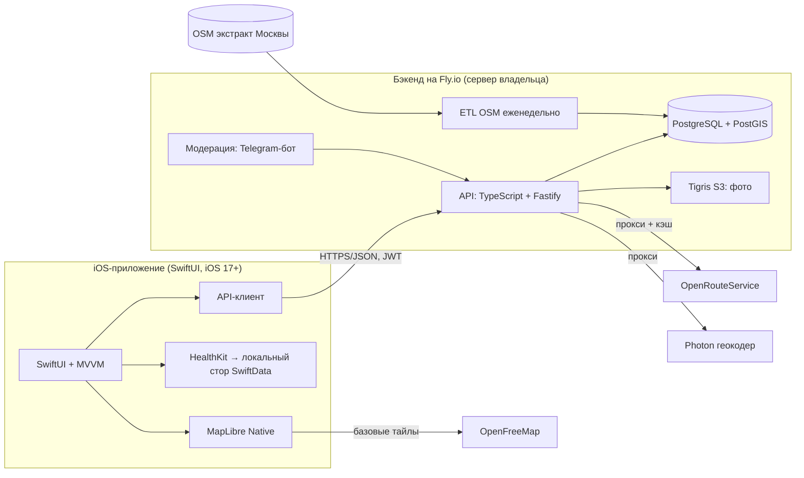

# Велосити — спецификация MVP

**Версия:** 0.1 · **Дата:** 2026-07-08 · **Статус:** черновик на утверждение
**Рабочее название:** «Велосити» (placeholder — финальное имя см. §15)
**Платформа MVP:** iOS (Swift/SwiftUI) · **Пилотный город:** Москва
**English version:** [spec.en.md](spec.en.md)

---

## 1. Видение

Приложение-карта для городских велосипедистов: вся велоинфраструктура и полезные места города на одной карте, веломаршруты из точки A в точку B — и всегда актуальные данные, потому что их обновляет само велосообщество и получает за это награды.

**Проблема:** непонятно, как безопасно и комфортно проехать по городу на велосипеде. Обычные навигаторы ведут по дорогам для машин, данные о велодорожках разрозненны и быстро устаревают.

**Решение:** карта велоинфраструктуры (включая типы дорожек и MTB-трейлы) + вело-POI + построение веломаршрутов + краудсорсинг правок и отчётов с системой наград.

**Ключевое отличие** (по решению владельца): удобство и точность; данные актуализируются быстрее всех за счёт пользователей, вклад которых вознаграждается.

## 2. Аудитория и персоны

**Основная аудитория:** городские райдеры Москвы — ездят на работу, учёбу и по делам.

**Персоны:**

1. **Аня, 28, едет на работу.** Хочет маршрут с максимумом выделенных дорожек и минимумом опасных перекрёстков. Ценит: маршрут A→B с приоритетом инфраструктуры, предупреждения о перекрытиях.
2. **Сергей, 35, райдер выходного дня.** Катается по паркам и набережным, иногда с ребёнком. Ценит: карту дорожек с типами (где безопасно с ребёнком), питьевые фонтаны, парковки, мастерские рядом.
3. **Дима, 30, MTB-энтузиаст (вторичная).** Катается в Битце и Крылатском. Ценит: слой трейлов со сложностью и покрытием, маршрут до трейлов, отчёты о состоянии.

## 3. Конкуренты и позиционирование

| Конкурент | Что делает | Почему мы другие |
|---|---|---|
| Komoot / Strava | спорт и туризм, планирование заездов | мы про повседневный город: инфраструктура, безопасность, актуальность |
| Google/Apple/Яндекс Карты | вело-режим вторичен, слой дорожек беден и устаревает | у нас велоинфраструктура — главный объект, обновляется сообществом |
| Bikemap | глобальная карта маршрутов | у нас гиперлокальная точность пилотного города + награды за правки |
| OsmAnd / OSM-приложения | сила OSM, но интерфейс для гиков | делаем то же ядро данных дружелюбным для обычного горожанина |

Позиционирование: **самая точная и свежая карта велогорода, которую обновляет само сообщество.**

## 4. Границы MVP

### Входит в MVP

- Карта Москвы (MapLibre, кастомный стиль, светлая/тёмная тема).
- Слой велоинфраструктуры с типами и покрытием + слой MTB-трейлов со сложностью.
- POI (минимальный набор): веломастерские, велопарковки, прокат/велошеринг, питьевые фонтаны.
- Маршрут A→B, профили «Город» и «MTB», профиль высот.
- Отчёты о проблемах с фото (яма, стекло, стройка/перекрытие, опасность, другое) + подтверждение/устаревание.
- Правки инфраструктуры от пользователей (новая дорожка, исправление) с модерацией — ядро продукта.
- Очки за принятый вклад, экран «Мой вклад».
- Обязательная регистрация: Sign in with Apple + Google.
- Профиль: избранные места и маршруты, мои отчёты и правки, очки, удаление аккаунта.
- Импорт поездок из Apple Health (трек, дистанция, скорость, пульс) — хранение локально на устройстве.
- Локализация RU/EN, тёмная тема, iOS 17+.

### Не входит в MVP (не-цели)

- Android-приложение (фаза 2; API проектируется платформонезависимым с первого дня).
- Пошаговая (turn-by-turn) навигация с голосом.
- Запись треков внутри приложения (поездки берём из Apple Health).
- Оффлайн-режим (архитектура не должна ему мешать в будущем).
- Импорт/экспорт GPX.
- Пуш-уведомления (фаза 2 — требуют платного Apple Developer аккаунта).
- Монетизация, реклама, платные функции.
- Соцфункции: комментарии, подписки, лента, лидерборды (лидерборд — фаза 2).
- Веб-версия, iPad-оптимизация, Apple Watch.
- Прямая запись правок в OSM (наши правки живут в своей БД; экспорт в OSM — фаза 2, см. §12).

## 5. Ключевые пользовательские сценарии

1. **Первый запуск:** онбординг (2–3 экрана ценности) → вход через Apple/Google → карта города с включёнными слоями.
2. **Понять, где безопасно ехать:** открыть карту → легенда типов дорожек → тап по сегменту → тип, покрытие, источник, свежесть.
3. **Доехать A→B:** задать точки (тап/поиск/«я») → профиль «Город» → маршрут с дистанцией, временем, набором высоты и профилем высот → сохранить в избранное.
4. **Сообщить о проблеме:** кнопка «+» → категория → точка (по умолчанию текущая) → фото → отправить → отчёт виден всем, автор получает очки после модерации.
5. **Добавить новую дорожку:** «+» → «предложить правку» → нарисовать линию по точкам → тип и покрытие → фото → на модерацию → после принятия появляется на карте, автору начисляются очки, статус виден в «Моём вкладе».
6. **Подтвердить чужой отчёт:** тап по значку отчёта → «подтверждаю» или «уже неактуально» → влияет на срок жизни отчёта.
7. **Посмотреть свою поездку:** профиль → «Поездки» → разрешение Health → импорт велотренировок → трек на карте + скорость/пульс.

## 6. Функциональные требования

Приоритеты: **MUST** — без этого MVP не выпускаем; **SHOULD** — очень желательно; **MAY** — если успеем.

### Карта (MAP)

- **MAP-1 (MUST).** Базовая карта MapLibre с кастомным стилем, поддержка светлой и тёмной темы.
- **MAP-2 (MUST).** Слой велоинфраструктуры из нашей БД. Типы: выделенная велодорожка; велополоса на проезжей части; совмещённая с пешеходами; MTB-трейл (со сложностью); прочий веломаршрут. Различимая раскраска + легенда.
- **MAP-3 (MUST).** Тап по сегменту: тип, покрытие (асфальт/грунт/гравий/неизвестно), качество (если есть), источник (OSM / сообщество), дата обновления.
- **MAP-4 (MUST).** Слой POI с кластеризацией: мастерские, велопарковки, прокат/шеринг, питьевые фонтаны. Карточка POI: название, тип, адрес, фото, «проложить маршрут».
- **MAP-5 (MUST).** Слой активных отчётов с иконками по категориям.
- **MAP-6 (MUST).** Геолокация: точка «я», кнопка центрирования, ориентация по компасу.
- **MAP-7 (MUST).** Поиск адреса/места (геокодер через наш бэкенд).
- **MAP-8 (SHOULD).** Управление слоями: вкл/выкл инфраструктуру, MTB, типы POI, отчёты.

### Маршруты (RTE)

- **RTE-1 (MUST).** A→B: старт/финиш через тап по карте, поиск или «моё местоположение».
- **RTE-2 (MUST).** Профили: «Город» (приоритет велоинфраструктуры и спокойных улиц), «MTB» (допускает грунт и трейлы).
- **RTE-3 (MUST).** Результат: линия маршрута, дистанция, оценка времени, набор высоты, график профиля высот.
- **RTE-4 (SHOULD).** Доля маршрута по велоинфраструктуре, %.
- **RTE-5 (MUST).** Сохранение маршрута в избранное и открытие из избранного.
- **RTE-6 (MAY).** Промежуточные точки.

### Отчёты о проблемах (REP)

- **REP-1 (MUST).** Создание: категория (яма, стекло/мусор, стройка/перекрытие, опасность, другое), геоточка, комментарий, до 3 фото.
- **REP-2 (MUST).** Действия других: «подтверждаю» / «уже неактуально» (по одному голосу на пользователя).
- **REP-3 (MUST).** Жизненный цикл: активен → истёк (по умолчанию 14 дней без подтверждений; каждое подтверждение продлевает; параметры настраиваются) → скрыт. Модератор может закрыть вручную.
- **REP-4 (MUST).** «Мои отчёты» в профиле со статусами.

### Правки инфраструктуры (EDIT) — ядро продукта

- **EDIT-1 (MUST).** «Новая дорожка»: рисование линии по точкам на карте (добавить/подвинуть/удалить точку), тип, покрытие, комментарий, фото.
- **EDIT-2 (MUST).** «Исправление сегмента»: выбрать сегмент → изменить тип/покрытие или пометить «больше не существует» с комментарием.
- **EDIT-3 (MUST).** Статусы: на модерации → принята (сразу видна на карте с пометкой «данные сообщества») / отклонена (с причиной). Автор видит статус и причину.
- **EDIT-4 (MUST).** Инструмент модератора: список заявок с геометрией/фото и действиями принять/отклонить/поправить. Реализация: Telegram-бот модерации (рекомендация — быстро и удобно основателю) или минимальная веб-админка. Решить в M4.
- **EDIT-5 (MAY).** Пакетный экспорт принятых правок для контрибуции в OSM (фаза 2; см. лицензию, §12).

### Очки и награды (PTS)

- **PTS-1 (MUST).** Начисление очков только после одобрения модератором: принятая правка +50, принятый POI +20, отчёт +10 (после валидации), подтверждение отчёта +2. Числа — стартовое допущение, конфигурируются на сервере.
- **PTS-2 (MUST).** Экран «Мой вклад»: очки, счётчики (правки/отчёты/подтверждения), история начислений.
- **PTS-3 (MUST).** Антиабуз: дневные лимиты начислений, очки не начисляются за отклонённое, один голос на объект.
- **PTS-4 (фаза 2).** Уровни, бейджи, лидерборд, партнёрские награды (скидки веломастерских и магазинов — синергия с будущей монетизацией). Чем именно награждать сверх очков — открытый вопрос (§15).

### Аккаунт (ACC)

- **ACC-1 (MUST).** Онбординг: 2–3 экрана ценности до входа.
- **ACC-2 (MUST).** Регистрация обязательна для использования приложения (решение владельца; риск для конверсии зафиксирован в §14). Способы: Sign in with Apple и Google Sign-In.
- **ACC-3 (MUST).** Профиль: никнейм (генерируется, редактируется), аватар (опционально), очки.
- **ACC-4 (MUST).** Избранное: места и маршруты.
- **ACC-5 (MUST).** Удаление аккаунта из приложения (требование App Store) с каскадной анонимизацией вклада (правки/отчёты остаются, но отвязываются от личности).

### Поездки из Apple Health (HLT)

- **HLT-1 (MUST).** Подключение HealthKit: чтение велотренировок, маршрутов (WorkoutRoute), пульса, дистанции. Понятное объяснение зачем.
- **HLT-2 (MUST).** Список велотренировок, импорт выбранных.
- **HLT-3 (MUST).** Экран поездки: трек на карте, дистанция, длительность, средняя/максимальная скорость, набор высоты, средний пульс (если есть).
- **HLT-4 (MUST).** Приватность: данные поездок хранятся **только локально на устройстве**, на сервер не передаются (см. §12). Облачная синхронизация — фаза 2 с отдельным согласием.

### Настройки и прочее (SET)

- **SET-1 (MUST).** Язык: системный по умолчанию, ручной выбор RU/EN. Тема: системная/светлая/тёмная.
- **SET-2 (MUST).** «О приложении»: версия, политика конфиденциальности, **атрибуция OpenStreetMap (ODbL)** — обязательна и на самой карте (© OpenStreetMap contributors).
- **SET-3 (SHOULD).** Экран «Правила сообщества» (что считается хорошей правкой/отчётом).

## 7. Данные и внешние интеграции

| Область | Решение для MVP | Примечания |
|---|---|---|
| База велоданных | OpenStreetMap, экстракт Москвы | еженедельный ETL; теги: `highway=cycleway`, `cycleway=*`, `bicycle=*`, `mtb:scale`, `surface`, `smoothness` |
| Правки сообщества | своя БД (overlay поверх OSM) | принятые правки отображаются сразу, в OSM не пишем (фаза 2) |
| Базовые тайлы карты | OpenFreeMap (бесплатно, без ключа) | fallback: свои PMTiles-тайлы Москвы на нашем сервере |
| Наши слои (инфраструктура, POI, отчёты) | GeoJSON по bbox с бэкенда, с кэшом | целевое состояние — векторные тайлы (martin/PostGIS), допустимо после MVP |
| Роутинг | внешний API через наш прокси: OpenRouteService (профили cycling-regular / cycling-mountain) | бесплатный тариф; fallback GraphHopper API; сравнить качество в Москве на этапе M2 |
| Геокодер | Photon (komoot) через наш прокси | fallback Nominatim; соблюдать usage policy |
| Поездки | Apple HealthKit (чтение) | локальное хранение |
| Аутентификация | Sign in with Apple, Google Sign-In | обмен на наш JWT на бэкенде |
| Фото | S3-совместимое хранилище (Tigris на Fly) | presigned upload, лимит размера, сжатие на клиенте |

**Принцип:** клиент ходит только к нашему API (кроме базовых тайлов) — ключи внешних сервисов не покидают сервер, провайдера роутинга/геокодера можно заменить незаметно для клиента, ответы кэшируются.

## 8. Архитектура



### iOS

- Swift 5.10+, SwiftUI, MVVM, Swift Concurrency (async/await), iOS 17+.
- Карта: MapLibre Native iOS (SPM), кастомный style JSON: базовые тайлы OpenFreeMap + наши источники слоёв.
- Локальное хранилище: SwiftData (импортированные поездки, избранное, кэш справочников); JWT — в Keychain.
- Модули (SPM-пакеты): `AppCore`, `MapUI`, `APIClient`, `HealthImport`, `DesignSystem`.
- Локализация через String Catalogs (ru, en).

### Бэкенд (допущение — подтвердить, §15)

- TypeScript + Fastify, PostgreSQL 16 + PostGIS; деплой на Fly.io (сервер владельца), бюджет ≤ $15/мес (§13).
- REST JSON API, описан OpenAPI-схемой (из неё же — типы клиента).
- Auth: верификация identity-токенов Apple/Google на сервере → свой JWT (короткоживущий) + refresh.
- Фото: presigned URL в Tigris, валидация типа/размера, EXIF-очистка.
- ETL OSM: еженедельный cron (Fly Machines): скачать экстракт Москвы → отфильтровать вело-теги (osmium) → загрузить в PostGIS → пересчитать витрину слоёв. Правки сообщества хранятся отдельной таблицей и мерджатся на выдаче.
- Модерация: Telegram-бот (заявки с фото и геометрией, кнопки принять/отклонить) — рекомендация; альтернатива — мини-веб-админка с basic auth.
- Логи/ошибки: Fly logs + Sentry free tier (MAY).

## 9. Модель данных (основные сущности)

- **users**: id, apple_sub / google_sub, nickname, avatar_url, points, locale, created_at, deleted_at.
- **infra_segments**: id, geom (LineString), kind (cycleway | lane | shared | mtb_trail | other), surface, smoothness, mtb_scale, source (osm | community), osm_way_id?, status (active | removed), updated_at.
- **pois**: id, geom (Point), kind (workshop | parking | rental | fountain), name, details (jsonb), source, status.
- **edit_proposals**: id, user_id, type (new_segment | modify_segment | new_poi | modify_poi), geom?, payload (jsonb), photo_keys[], status (pending | approved | rejected), reject_reason, created_at, reviewed_at.
- **reports**: id, user_id, geom (Point), category, comment, photo_keys[], status (active | expired | resolved), confirmations, expires_at, created_at.
- **report_votes**: report_id, user_id, kind (confirm | gone), unique(report_id, user_id).
- **favorites**: id, user_id, type (place | route), payload (jsonb: точки, профиль, геометрия).
- **points_ledger**: id, user_id, delta, reason, ref_type, ref_id, created_at.
- **events**: минимальная продуктовая аналитика (см. §11).

Поездки из Health в БД сервера **не хранятся** (только локально на устройстве).

## 10. Эскиз API

```
POST /auth/apple | /auth/google        → JWT + refresh
POST /auth/refresh
GET  /me · PATCH /me · DELETE /me
GET  /me/contributions                 (правки, отчёты, очки, история)

GET  /map/segments?bbox&kinds          → GeoJSON
GET  /map/pois?bbox&kinds              → GeoJSON
GET  /map/reports?bbox                 → GeoJSON

POST /reports                          (+ presigned фото)
POST /reports/{id}/vote                (confirm | gone)

POST /edits                            (new_segment | modify_segment | new_poi | modify_poi)
GET  /edits/{id}

POST /route                            {from, to, profile: city|mtb} → геометрия, дистанция, время, высоты
GET  /geocode?q=

POST /favorites · GET /favorites · DELETE /favorites/{id}
POST /events                           (аналитика, батчами)

POST /uploads/presign                  (фото)
```

Модерация — отдельные эндпоинты под ролью moderator (используются ботом/админкой).

## 11. Нефункциональные требования

- **Производительность:** карта 60 fps на iPhone 12 и новее; холодный старт < 3 с; ответы API (кроме /route) p95 < 300 мс; /route p95 < 2 с.
- **Объём данных:** слои Москвы в вьюпорте — инкрементально по bbox с кэшом; трафик первого экрана < 5 МБ.
- **Деградация без сети:** карта из кэша тайлов, понятное состояние «нет сети», отчёт можно дописать и отправить при появлении сети (очередь — SHOULD).
- **Доступность:** Dynamic Type, VoiceOver-метки для ключевых экранов, контраст легенды слоёв в обеих темах.
- **Локализация:** 100% строк в RU и EN, включая категории и статусы.
- **Аналитика (минимум):** события: запуск, построение маршрута, создание отчёта/правки, импорт Health — в свою БД, без сторонних SDK.
- **Надёжность бэкенда:** ежедневный бэкап БД (snapshot + недельный dump в Tigris), health-check, автодеплой из git.

## 12. Приватность и юридические аспекты

- **Минимизация данных:** храним только идентификатор входа (sub), никнейм, аватар (опц.), вклад и очки. Email не обязателен (Apple «скрыть email» поддерживается). Треки поездок — только локально на устройстве.
- **152-ФЗ (риск):** пользователи — в России, сервер — Fly.io за пределами РФ. Закон требует локализации хранения ПД граждан РФ. Митигация: жёсткая минимизация ПД (псевдонимные данные), фиксация риска, **консультация юриста до публичного запуска**; при необходимости — перенос БД на хостинг в РФ (архитектура это позволяет). Этот документ не является юридической консультацией.
- **Геоданные отчётов/правок** публичны по своей природе (это данные о городе, не о человеке); в интерфейсе предупреждаем: «не создавайте отчёты у своего дома, если не хотите раскрывать локацию».
- **Лицензия OSM (ODbL):** обязательная атрибуция на карте и в «О приложении». Наша БД (OSM + правки сообщества) — производная работа: при публичном распространении данных действует share-alike. Практически: держим за собой право открыть слой правок; контрибуция в OSM (фаза 2) с этим совместима.
- **App Store:** удаление аккаунта внутри приложения; экраны согласий Health с понятными формулировками; возрастной рейтинг 4+; дисклеймер: «маршруты носят рекомендательный характер, оценивайте обстановку на дороге самостоятельно».

## 13. Бюджет сервисов (цель ≤ $15/мес)

| Статья | Оценка/мес |
|---|---|
| Fly.io: VM API (shared-cpu-1x) | ~$3–5 |
| Fly.io: PostgreSQL + volume 10 GB | ~$2–4 |
| Tigris (фото) | $0 (free tier) на пилоте |
| OpenFreeMap (тайлы) | $0 |
| OpenRouteService, Photon | $0 (free tier / fair use) |
| Sentry (опц.) | $0 (free tier) |
| **Итого** | **~$5–9**, запас до лимита есть |

Разовые: Apple Developer Program $99/год (нужен к этапу M3 — Sign in with Apple и TestFlight не работают без него).

## 14. Риски и допущения

| Риск | Влияние | Митигация |
|---|---|---|
| Доступность внешних API из РФ (ORS, OpenFreeMap, Photon) | карта/маршруты не работают | всё через наш прокси на Fly; тайлы можно перенести к себе (PMTiles); мониторим на пилоте |
| 152-ФЗ: ПД россиян вне РФ | юридический | см. §12: минимизация, юрист, возможный перенос БД в РФ |
| Обязательная регистрация до карты | потеря части пользователей на входе | сильный онбординг; если конверсия плохая — рассмотреть гостевой просмотр в v1.1 |
| Качество OSM-разметки Москвы | дыры в слое дорожек | краудсорсинг это и лечит; ручная сверка ключевых районов на M1 |
| Ручная модерация основателем | узкое место при росте | Telegram-бот с быстрыми действиями; правила сообщества; лимиты |
| Лимиты бесплатного тарифа роутинга | отказ /route в пике | кэш маршрутов, fallback-провайдер, при росте — свой роутинг-сервер (фаза 2) |
| Apple Dev аккаунт «потом» | Sign in with Apple и TestFlight недоступны до покупки | этапы M0–M2 не требуют аккаунта; купить до M3 |
| HealthKit-энтайтлменты | ограничения без платного аккаунта | HealthKit работает с Personal Team (кроме клинических записей) — проверить на M5 первым делом |
| Сезонность (зима в Москве) | падение активности | закладывать бету к началу сезона; зимний режим — не наша забота в MVP |

**Допущения (принял сам, поправь если что):** стек бэкенда TypeScript+Fastify+PostGIS; значения очков из PTS-1; сроки жизни отчётов из REP-3; POI-минимум из четырёх типов; модерация через Telegram-бот.

## 15. Открытые вопросы

1. **Название.** Шорт-лист: Велосити/VeloCity · Велополис/Velopolis · Велолейн/VeloLane · Крутим/Krutim · ВелоКарта/VeloMap · Спица/Spoke. Проверить занятость в App Store и товарные знаки до финализации.
2. **Чем награждать за вклад** (сверх очков): бейджи/уровни/лидерборд; «хранитель района»; партнёрские награды (скидки мастерских — синергия с будущей монетизацией); мерч. Решить к M4.
3. **Стек бэкенда** — подтвердить TypeScript+Fastify (владелец предоставит доступ к серверу Fly).
4. **Дизайн-материалы** — владелец обещал прислать (стиль, референсы, лого). До получения — аккуратный системный стиль SwiftUI.
5. **Роутинг-провайдер** — финальный выбор ORS vs GraphHopper по качеству веломаршрутов в Москве (тест на M2).
6. **Контрибуция правок в OSM** — делать ли в фазе 2 и в каком процессе.

## 16. Роадмап

Оценки — грубые, при работе в свободном темпе («хоть сколько»); указаны для порядка величины.

| Этап | Содержание | Оценка |
|---|---|---|
| **M0. Фундамент** | имя, репозиторий, скелет API+БД на Fly, ETL OSM (PoC), скелет iOS с картой MapLibre | 1–2 нед |
| **M1. Карта и данные** | слои инфраструктуры и MTB, POI, легенда, поиск, карточки сегментов/POI | 2–3 нед |
| **M2. Маршруты** | A→B, профили город/MTB, высоты, избранное; сравнение ORS/GraphHopper | 1–2 нед |
| **M3. Аккаунты** | Apple + Google вход, профиль, удаление аккаунта *(нужен Apple Dev аккаунт)* | 1–2 нед |
| **M4. Сообщество** | отчёты, правки с рисованием, очки, модерация (TG-бот), правила | 2–3 нед |
| **M5. Поездки** | HealthKit-импорт, экран поездки | 1–2 нед |
| **M6. Полировка** | локализация, тёмная тема сквозняком, a11y, онбординг, пустые состояния, атрибуция, TestFlight-бета | 1–2 нед |

**Итого MVP:** ориентировочно 9–16 недель part-time → закрытая бета в TestFlight → пилот-тест в Москве (метрики успеха определим перед бетой — решение владельца «пока не фиксировать»).

**Фаза 2 (после пилота):** Android (решение native Kotlin vs KMP), пуш-уведомления, гостевой просмотр (если нужен), Strava-интеграция, оффлайн-карты, лидерборды и партнёрские награды, пошаговая навигация, свой роутинг-сервер, контрибуция в OSM, монетизация (партнёрства).
